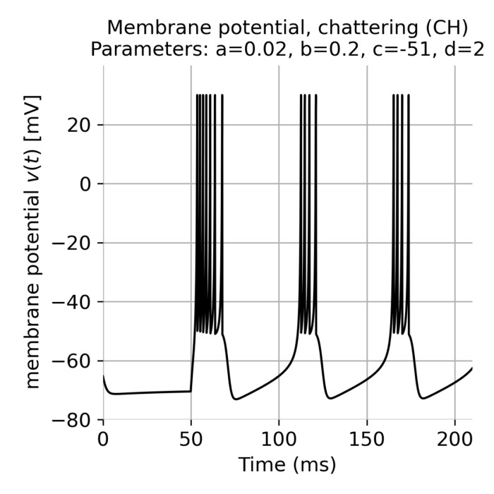

# Izhikevich model

Python scripts supporting tutorials on Izhikevich neuron model. For more details, see these blog posts:

* [Izhikevich model](https://www.fabriziomusacchio.com/blog/2024-04-29-izhikevich_model/)
* [Simulating spiking neural networks with Izhikevich neurons](https://www.fabriziomusacchio.com/blog/2024-05-19-izhikevich_network_model/)

For reproducibility:

```bash
conda create -n izhikevich -y python=3.11
conda activate izhikevich
conda install -y mamba
mamba install -y ipykernel numpy matplotlib scipy
```





